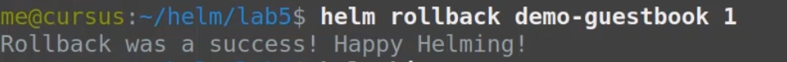

# kubernetes-helm-concepts

##### References
- https://github.com/phcollignon/helm3
- https://helm.sh/
- https://artifacthub.io/
- https://kubernetes.io/docs/reference/kubernetes-api
- https://spring.io/guides/gs/accessing-data-mysql
- https://helm.sh/docs/intro/install/
- https://github.com/asinghalgit/spring-boot-mysql-helm

#### What is the context of using helm?


#### Why helm?
To deploy a single application (production grade), we need to do following things to deploy in kubernetes cluster
- Application
- containerazied application
- deployment and pod
- config map
- secrets
- service
- ingress
- install above resources one by one in correct order


For example - one way could be as follows:

- we write a script by which we deploy all the workload resources mentioned above
- but then what will happen if we need to roll back to previous version of application etc.


- Till now, we have installed new version of application

- Now, Project manager asks to roll back to previous version

- Now, dev ops team realize that they need a tool for packaing and versioning applications

#### what is helm?

- Helm is package manager for kubernetes


#### How does Helm 3 work?
- instead of using kubectl command for each kubernetes object, we embed kubernetes object definitions in 
a package called a chart
-  Chart is then passed to Helm
- Helm connects to kubernetes api to create kubernetes objects
- Helm uses kubernetes client to talk to REST kubernetes API and its security layer


#### Where does Helm store release history and configuration?
- Helm stores release manifests inside Kubernetes as secrets. This provides history and persistence for all the releases.
- These are stored in same namespace as your application namespace
- it is centralized in cluster

#### What will happen if i modify the kubernetes objects with a tool other than Helm?


#### By default, which Kubernetes namespace is used by Helm to store kubernetes objects?
Default namespace but you can tell Helm to use different namespace 


#### How does Kubernetes environment with Helm look like?


#### How to install Helm?

```
- curl -LO https://get.helm.sh/helm-v3.5.4-linux-amd64.tar.gz
- tar -zxvf helm-v3.5.4-linux-amd64.tar.gz 
- sudo mv linux-amd64/helm /usr/local/bin/helm
- helm help
- helm repo add stable https://charts.helm.sh/stable
- helm search repo stable
```


#### By default, Helm is configured to use which repository?
Helm is by default not configured to use any repository. So it has to be manually configured.

#### How to add official Helm chart repository? Also give an example of installing sample chart.

```
- helm search repo stable
- helm repo update
- helm install stable/mysql --generate-name
- helm show chart stable/mysql
- helm show all stable/mysql
- helm ls
- helm list
- helm uninstall smiling-penguin
- helm status smiling-penguin
```


#### What is recommended way to delete objects installed using Helm?
Via uninstall command


#### Please explain a bit around structure of Helm chart.


#### Please explain how we can document around Helm chart.


#### Please explain more about Chart.yaml file.


#### Which are the most commonly used Helm commands?


#### Let's do some exercise

- deploy standalone spring-boot-hello-app using helm

```
- 
```


- deploy enterprise app (UI + backend + DB) using helm


- example of installing Guestbook release (1.0 -> 2.0) -> 1.0)

```
- helm install demo-guestbook guestbook
- kubectl get pods -l app=frontend
- helm list --short
- helm get manifest demo-guestbook | less
- helm upgrade demo-guestbook guestbook
- kubectl describe pods -l app=frontend
- helm status demo-guestbook
- helm rollback demo-guestbook 1
- helm history demo-guestbook
- helm uninstall demo-guestbook
```





- example of installing spring-boot-mysql-app

```
- helm create spring-boot
- tree spring-boot
- helm install demo-spring-boot spring-boot
- helm list --short
- helm status demo-spring-boot
- helm history demo-spring-boot
- helm get manifest demo-spring-boot
```

Source Code - https://github.com/asinghalgit/spring-boot-mysql-helm


