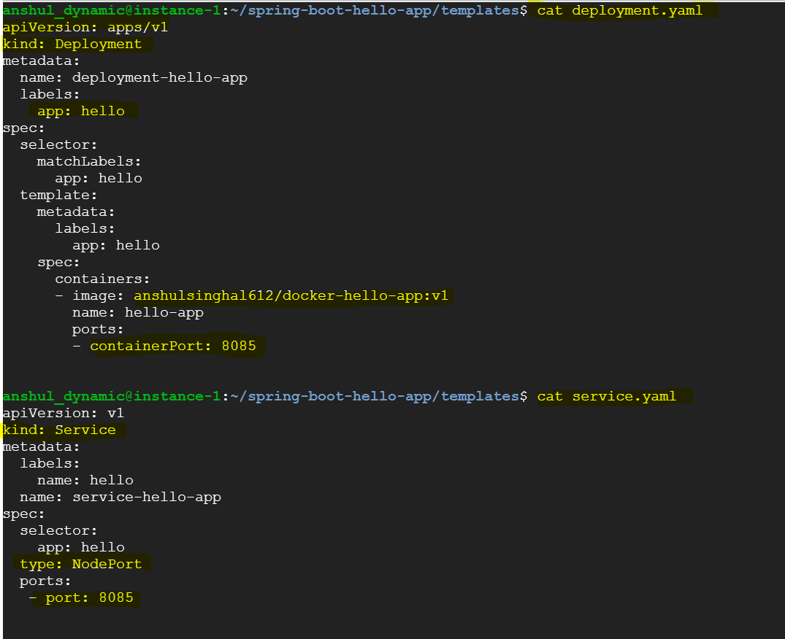

# kubernetes-helm-concepts

##### References
- https://github.com/phcollignon/helm3
- https://helm.sh/
- https://artifacthub.io/
- https://kubernetes.io/docs/reference/kubernetes-api/service-resources/service-v1/#ServiceSpec

#### What is the context of using helm?

#### Why helm?
To deploy a single application (production grade), we need to do following things to deploy in kubernetes cluster
- Application
- containerazied application
- deployment and pod
- config map
- secrets
- service
- ingress
- install above resources one by one in correct order

For example - one way could be as follows:

- we write a script by which we deploy all the workload resources mentioned above
- but then what will happen if we need to roll back to previous version of application etc.

- Till now, we have installed new version of application

- Now, Project manager asks to roll back to previous version

- Now, dev ops team realize that they need a tool for packaing and versioning applications

#### what is helm?

- Helm is package manager for kubernetes

#### How does Helm 3 work?
- instead of using kubectl command for each kubernetes object, we embed kubernetes object definitions in 
a package called a chart
-  Chart is then passed to Helm
- Helm connects to kubernetes api to create kubernetes objects
- Helm uses kubernetes client to talk to REST kubernetes API and its security layer

#### Where does Helm store release history and configuration?
- Helm stores release manifests inside Kubernetes as secrets. This provides history and persistence for all the releases.
- These are stored in same namespace as your application namespace
- it is centralized in cluster

#### What will happen if i modify the kubernetes objects with a tool other than Helm?

#### By default, which Kubernetes namespace is used by Helm to store kubernetes objects?
Default namespace but you can tell Helm to use different namespace 

#### How does Kubernetes environment with Helm look like?

#### How to install Helm?

#### By default, Helm is configured to use which repository?
Helm is by default not configured to use any repository. So it has to be manually configured.

#### How to add official Helm chart repository? Also give an example of installing sample chart.

#### What is recommended way to delete objects installed using Helm?
Via uninstall command

#### Please explain a bit around structure of Helm chart.

#### Please explain how we can document around Helm chart.

#### Please explain more about Chart.yaml file.

#### Which are the most commonly used Helm commands?

#### Let's do some exercise

- deploy spring-boot-hello-app using helm

